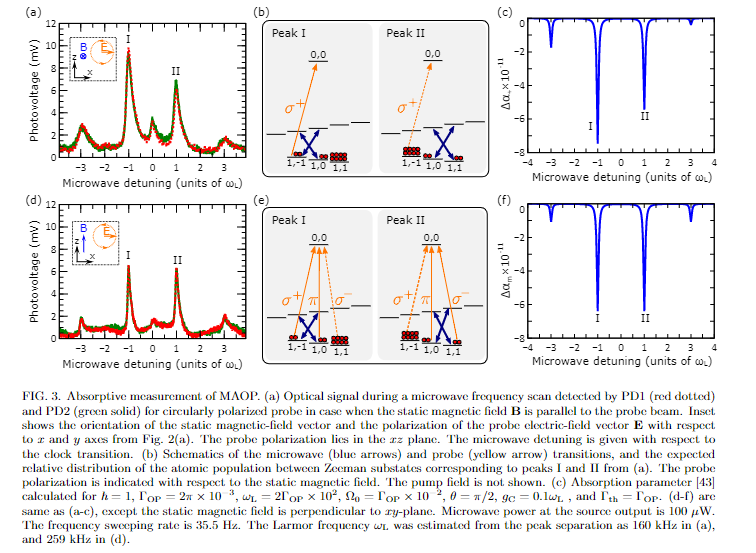

Here I included the code I used to simulate microwave-assisted optical pumping in [https://arxiv.org/abs/2110.10673](https://arxiv.org/abs/2110.10673) . 

In a nutshell, I calculate the steady-state population of $^{87}$Rb hyperfine ground state in the presence of a cavity-enhanced near-resonance microwave magnetic field and a resonant optical field. ****maop_steady-state.ipynb**** contains the code and relevant parts of the theoretical model. A detailed description of the theoretical model is in the paper’s appendix.

The theoretical model shows good qualitative agreement with the experiment:

